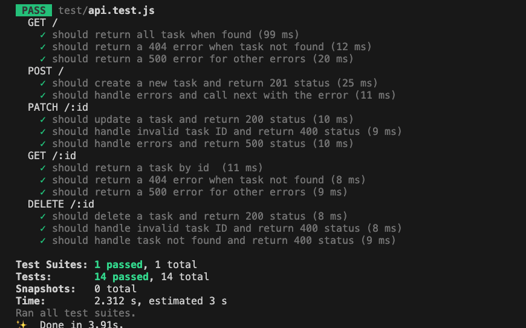
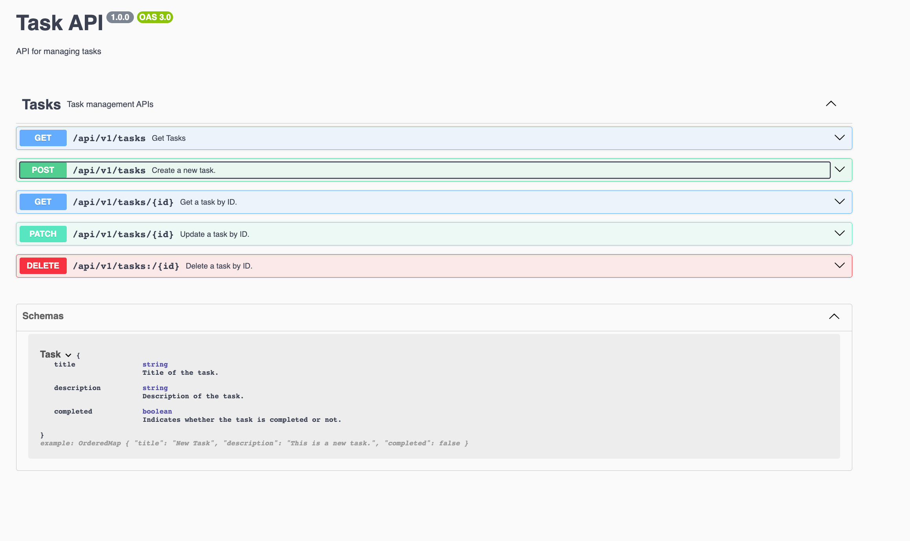

[](http://expressjs.com/)

  Fast, unopinionated, minimalist web framework for [Node.js](http://nodejs.org).
  
## Description
```bash
$ TECHNICAL TEST NODEJS ADITYA
```

## Installation

```bash
$ npm install
```
or

```bash
$ yarn install
```

## Running the app

```bash
$ yarn start
```
or
```bash
$ npm start
```
## Unit testing

```bash
$ npm test
```
or
```bash
$ yarn test
```


## API Documentation Swagger

```bash
$ {}url/docs
```

# Endpoint  GET
```
Request: 
Base_url = /api/v1

url : [ GET] {Base_url}/tasks

Response:
[
    {
        "_id": "650d53f412d38f32613838a6",
        "title": "Updated Title1",
        "description": "conba uda",
        "completed": false,
    },
    {
        "_id": "650dd655b0f8c919f51ea7f9",
        "title": "test1 code",
        "description": "this one is technical test123",
        "completed": false,
    }
]
```
# Endpoint POST
```
Request: 
Base_url = /api/v1

url : [Get] {Base_url}/tasks
payload : {
    "title": "create code",
    "description": "this one is technical test description",
    "completed": false
}


Response:
{
    "status": "ok",
    "message": "Task created succesfully",
    "id": "650dd655b0f8c919f51ea7f9"
}
```
## Support

Nest is an MIT-licensed open source project. It can grow thanks to the sponsors and support by the amazing backers. If you'd like to join them, please [read more here](https://docs.nestjs.com/support).

## License

Nest is [MIT licensed](LICENSE).

